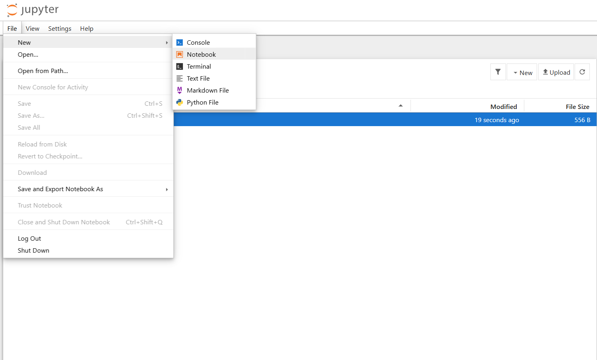
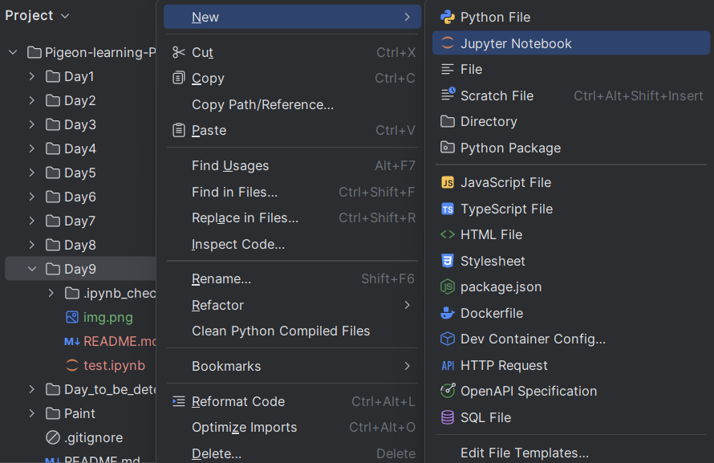

## Day 9: Jupyter Notebook

你好Sarah。今天我们来学习Jupyter notebook，就像它的名字一样，它很适合做笔记。我在想，要不我们以后就是用Jupyter Notebook来学习Python？

首先，你需要安装Jupyter Notebook，通过以下命令：

```bash
pip install notebook
# 我不确定上面这个命令能不能用，如果不行的话，试试下面这个
pip install jupyter notebook
```

安装完成后，你可以在命令行通过以下命令启动Jupyter Notebook：

```bash
jupyter notebook
```



就是像这样的界面。在这个界面中你可以创建新的笔记本，也可以打开已有的笔记本。笔记本的文件名是以`.ipynb`结尾的。

jupyter notebook不光有网页版，你还可以在pycharm或者vscode中使用它。比如在pycharm中，你可以通过在任意文件夹右键来创建一个新的Jupyter Notebook：如图所示：



那么接下来你应该可以打开这个notebook了。我创建了一个notebook，让我在notebook里在讲一些小知识~
